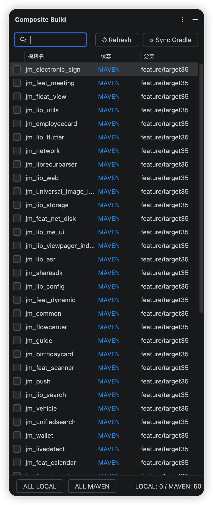
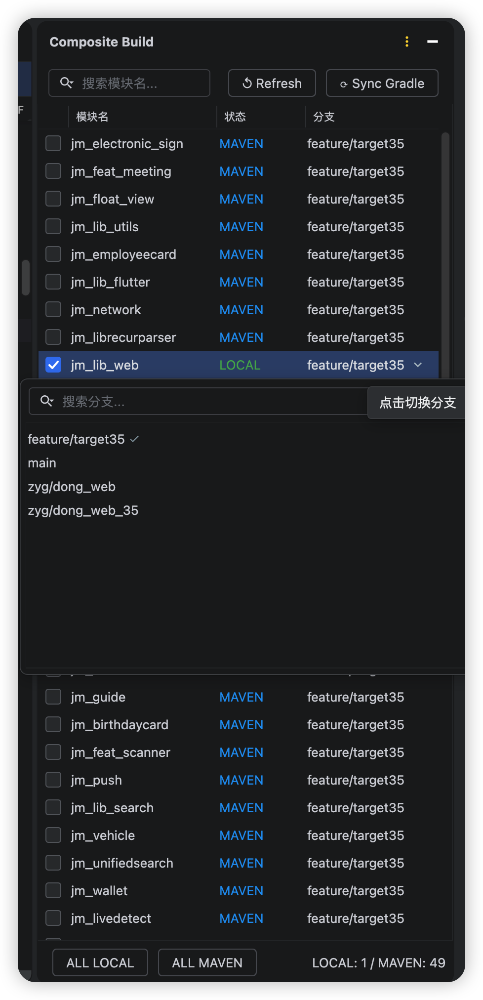

# Composite Build Manager — JetBrains Plugin

管理 Android 多模块复合构建（Composite Build）配置的 Android Studio 插件。

 

## 功能

| 功能 | 描述 |
|------|------|
| 可视化模块状态 | 展示所有子模块的 LOCAL / MAVEN / MISSING 状态 |
| 一键切换 | 勾选/取消勾选即可切换 includeBuild，自动写回 JSON5 并重新生成配置 |
| 批量操作 | 一键将全部模块切换为 LOCAL 或 MAVEN |
| 下载缺失模块 | 点击「↓ 下载」按钮自动克隆缺失的子模块 |
| Gradle Sync | 配置变更后一键触发 Gradle 同步，有未同步改动时按钮高亮提醒 |
| 分支管理 | 显示各模块当前 Git 分支，支持一键切换（含未提交修改检查） |
| 搜索过滤 | 支持按模块名搜索过滤 |
| 右键菜单 | 在 Project 视图中右键 → Composite Build 快速访问 |
| 自动刷新 | 面板显示或收起/展开时自动刷新最新勾选状态 |

## 构建插件

```bash
cd composite-build-plugin/
./gradlew buildPlugin
```

构建产物位于：`build/distributions/composite-build-plugin-*.zip`

## 安装

1. Android Studio → Settings → Plugins
2. 点击齿轮图标 → Install Plugin from Disk…
3. 选择 `build/distributions/composite-build-plugin-*.zip`
4. 重启 Android Studio

## 使用

1. 打开工程后，在右侧找到 **Composite Build** Tool Window
2. 勾选/取消勾选模块的复选框来切换 LOCAL / MAVEN 模式
3. 点击 **⟳ Sync Gradle** 按钮同步 Gradle

## 文件关系

| 文件 | 角色 |
|------|------|
| `scripts/module_manager/project-repos.json5` | 读写：模块配置中心 |
| `include_build.gradle` | 写入：自动生成的复合构建配置 |
| `scripts/module_manager/download-projects.js` | 委托执行：模块下载 |

## 兼容性

- Android Studio Hedgehog (2023.3.1) 及以上
- IntelliJ IDEA 2023.3+
