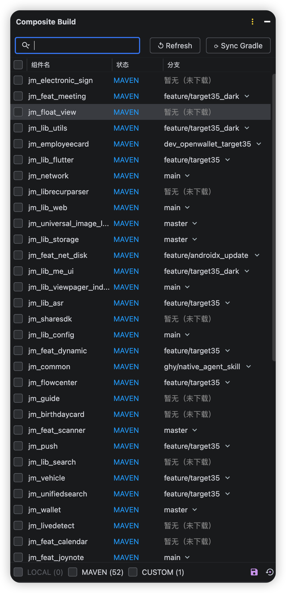
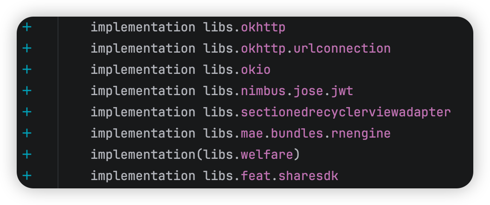
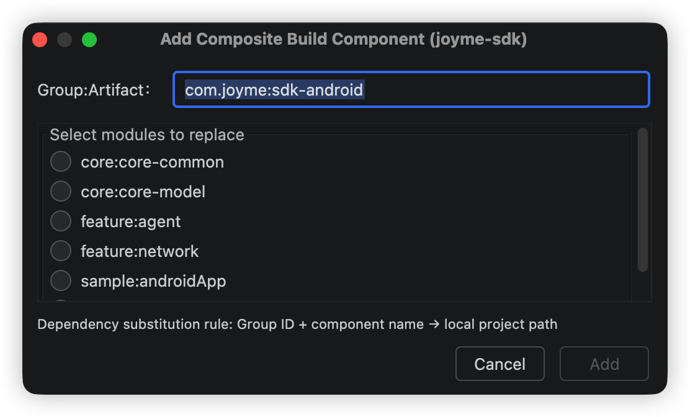

# Composite Build Manager — JetBrains 插件

[English](README.md) | 中文

管理 Android 多模块复合构建（Composite Build）配置的 Android Studio 插件。

## 功能

| 功能 | 描述 |
|------|------|
| 可视化模块状态 | 展示所有子模块的 LOCAL / MAVEN / MISSING 状态 |
| 一键切换 | 勾选/取消勾选即可切换 includeBuild，自动写入状态文件并在下次 Gradle 构建时生效 |
| 批量操作 | 一键将全部模块切换为 LOCAL 或 MAVEN |
| 下载缺失模块 | 点击「↓ 下载」按钮自动克隆缺失的子模块 |
| Gradle Sync | 配置变更后一键触发 Gradle 同步，有未同步改动时按钮高亮提醒 |
| 分支管理 | 显示各模块当前 Git 分支，支持一键切换（含未提交修改检查） |
| 搜索过滤 | 支持按模块名搜索过滤 |
| 右键菜单 | 在 Project 视图中右键 → Composite Build 快速访问 |
| 自动刷新 | 面板显示或收起/展开时自动刷新最新勾选状态 |
| 自定义组件 | 手动添加本地组件并配置依赖替换规则，支持路径持久化及复合构建 |
| 行标记 | 在 build.gradle 中为可复合构建的依赖显示行标记，支持从 Version Catalog 解析 group:artifact |

## 截图

<div align="center"></div>

<div align="center">
  
  &nbsp;&nbsp;
  
</div>

## 构建插件

```bash
cd composite-build-plugin/
./gradlew clean buildPlugin
```

构建产物位于：`build/distributions/composite-build-plugin-*.zip`

## 安装

1. Android Studio → Settings → Plugins
2. 点击齿轮图标 → Install Plugin from Disk…
3. 选择 `build/distributions/composite-build-plugin-*.zip`
4. 重启 Android Studio

## 使用

1. 打开工程后，在右侧找到 **Composite Build** Tool Window
2. 进入 Settings → Tools → Composite Build Manager，配置组件配置文件路径
3. 勾选/取消勾选模块的复选框来切换 LOCAL / MAVEN 模式
4. 点击 **⟳ Sync Gradle** 按钮同步 Gradle

## 文件关系

| 文件 | 角色 |
|------|------|
| 组件配置文件（路径在插件设置中配置） | 只读：模块配置中心（模块名、仓库地址、flavorAware 标记） |
| `~/.gradle/init.d/cbm.gradle` | 插件自动部署的 Gradle init script，负责读取状态文件并动态注入 includeBuild 配置 |
| `~/.gradle/cbm/<hash>.json` | 插件写入的状态文件，记录当前哪些模块启用了复合构建，由 init script 在构建时读取 |

## 组件配置文件格式说明

文件采用 [JSON5](https://json5.org/) 格式，支持注释和末尾逗号。

### 顶层结构

```json5
{
  "repositories": {
    "<模块名>": { ... },
    ...
  }
}
```

### 模块键名

与 `gradle/libs.versions.toml` 中 `[libraries]` 部分的键名一一对应（下划线分隔）。插件以此键名在 Version Catalog 和本地目录之间建立映射关系。

### 模块字段

| 字段 | 类型 | 必填 | 说明 |
|------|------|------|------|
| `url` | String | 是 | 子模块 Git 仓库的 SSH 地址，点击「↓ 下载」时用于 `git clone` |
| `path` | String | 否 | 本地目录的绝对路径；设置后以此路径读取组件，忽略默认的 `../<模块名>_project` 约定 |
| `flavorAware` | Boolean | 否 | 为 `true` 时，插件会为该模块生成 flavor 维度的依赖替换规则（默认 `false`）|

### 本地目录约定

子模块克隆后存放在与主工程**平级**的 `../<模块名>_project` 目录，例如：

```
workspace/
├── jm_android_project/   ← 主工程
└── jm_network_project/     ← jm_network 模块克隆位置
```

### 示例

```json5
{
  "repositories": {
    // 普通模块：仅需提供 Git 地址，本地目录约定为 ../<模块名>_project
    "jm_network": {
      "url": "xxx:xx/jm_network.git",
    },

    // 指定本地路径：设置 path 后以该路径读取组件，不再使用约定路径
    "jm_common": {
      "url": "xxx:xx/jm_common.git",
      "path": "/Users/dev/projects/jm_common",
    },

    // flavorAware 模块：需要按 flavor 生成依赖替换规则
    "jm_manto": {
      "url": "xxx:xx/manto_project.git",
      "flavorAware": true
    },
  }
}
```

## 兼容性

- Android Studio Hedgehog (2023.3.1) 及以上
- IntelliJ IDEA 2023.3+

## 历史版本

| 版本 | 新增功能 | Bug 修复 |
|------|---------|---------|
| 1.0.12 | 添加国际化支持和资源文件重构<br>添加项目配置功能并重构 UI | 组件配置文件支持 `path` 字段，可指定本地路径替代默认约定路径 |
| 1.0.11 | — | 修复 LocalBuildScanner 过滤 app module 的逻辑<br>在 project-repos.json5 不存在时不显示行标记加号 |
| 1.0.10 | — | 移除 IncludeBuildWriter，复合构建统一由 cbm.init.gradle 管理 |
| 1.0.9 | 支持从 Version Catalog (libs.xxx) 解析依赖的 group:artifact<br>添加自定义组件的依赖替换规则和行标记功能 | 修复Version Catalog依赖解析时的false positive问题，避免在成员访问链和本地模块依赖上添加行标记<br>改进自定义模块添加功能的异常处理和用户反馈<br>删除自定义组件时，仅在 LOCAL 状态时才自动触发 Gradle Sync<br>自定义组件删除后自动取消 CUSTOM 筛选并展示所有组件 |
| 1.0.8 | 新增 CUSTOM 筛选项及自定义组件删除功能<br>新增手动添加本地组件功能，支持自定义路径持久化及复合构建 | 修复筛选项数量为 0 时未自动取消勾选并置灰<br>修复 CUSTOM 模式下表头全选复选框未隐藏<br>扩展模块键名正则以支持连字符 |
| 1.0.7 | 新增保存/恢复 LOCAL 模块快照功能，按分支存储，方便切换场景时一键恢复 | 修复勾选模块为 LOCAL 时触发全量分支刷新的问题<br>分支加载仅在初始化和点击 Refresh 按钮时触发 |
| 1.0.6 | 分支弹窗保留远程分支 origin/ 前缀<br>分支列表优先展示本地分支，再展示远程分支<br>切换远程分支时自动创建同名本地跟踪分支，避免 detached HEAD<br>刷新分支时 LOCAL 模块分支列显示 loading 动画 | 修复刷新分支时 MAVEN 模块分支名消失 |
| 1.0.5 | 支持 flavor dependencySubstitution 自动生成<br>表头添加全选复选框<br>底部增加 LOCAL / MAVEN 互斥筛选复选框，整合状态统计显示<br>优化分支弹窗交互 | 修复重启后 Sync Gradle 按钮误报红<br>修复 cbm.init.gradle 中多 flavorAware 组件的依赖替换问题<br>修复多 flavorAware 组件同时启用时 dependencySubstitution 互相干扰<br>修复 repositories 块结束后 config/usage 被误解析为模块<br>修复 Refresh 按钮未重新加载 project-repos.json5 |
| 1.0.4 | 允许 MAVEN 状态的模块切换分支<br>下载模块时在复选框位置显示 loading 动画 | 修复删除本地目录后 Sync 时状态仍显示 LOCAL<br>修复分支列表只显示一个分支 |
| 1.0.3 | 显示本地 Git 实际分支<br>支持分支切换（含未提交修改检查）<br>分支列宽自适应、异步缓存<br>Sync 按钮有改动时高亮提醒 | 修复废弃 API 及编译警告<br>修复分支列最小宽度过小<br>工具窗口默认宽度改为 300 |
| 1.0.2 | 为插件添加工具窗口图标<br>面板显示时自动刷新勾选状态<br>配置变更后显示待 Sync 提醒 | 修复取消勾选后待 Sync 提示不消失<br>修复工具窗口收起展开时无法刷新勾选状态<br>移除插件版本上限限制以兼容更高版本 IDE |
| 1.0.1 | 改为手动触发 Gradle Sync | 修复状态列图标溢出到复选框列 |
| 1.0.0 | 初始版本：可视化模块 LOCAL / MAVEN / MISSING 状态<br>支持勾选切换 includeBuild 并自动写回配置<br>一键触发 Gradle Sync<br>支持下载缺失模块 | — |
